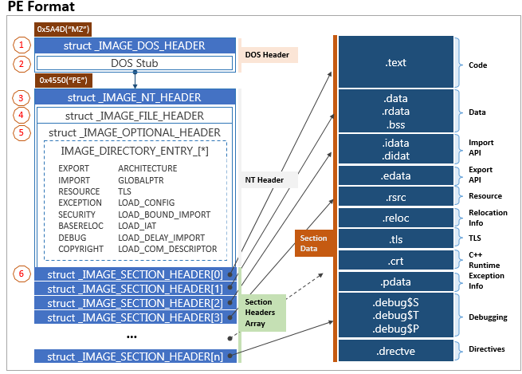
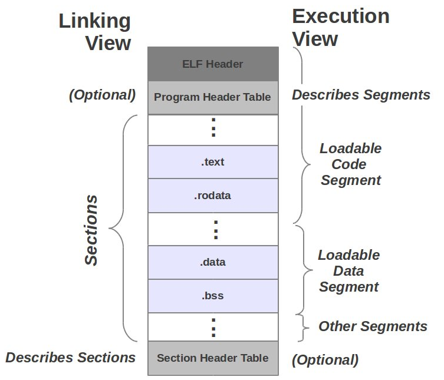
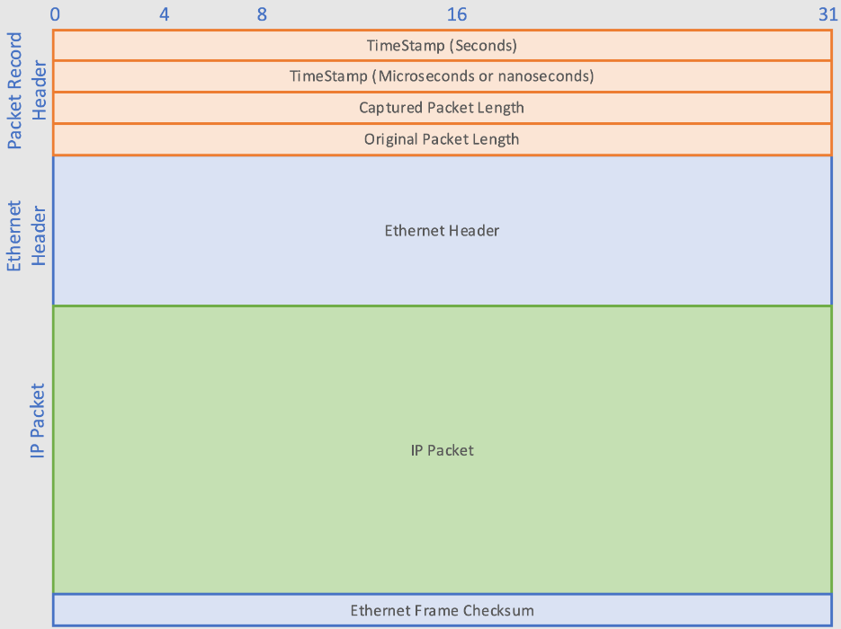
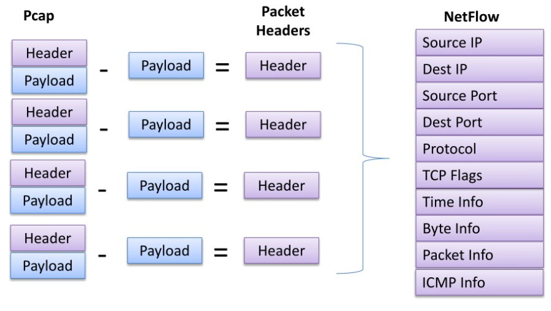
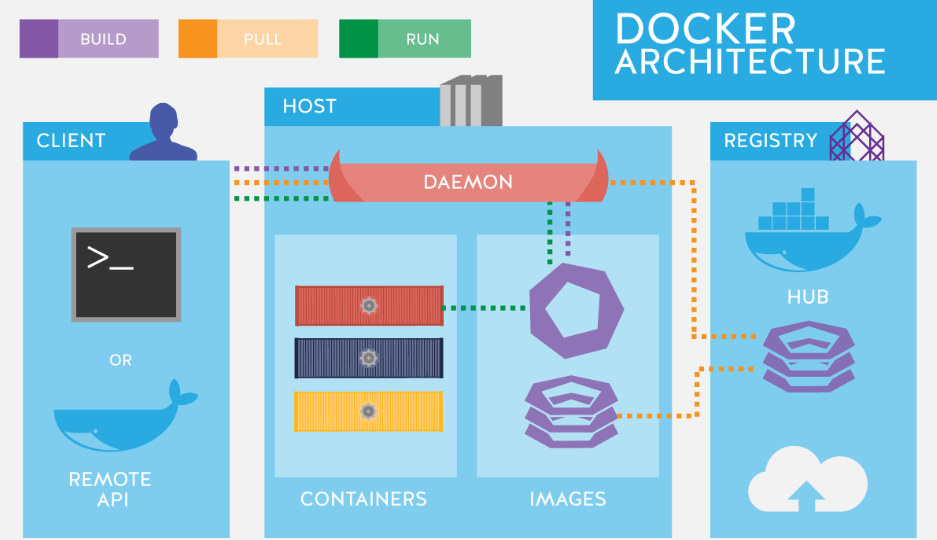

# Cybersecurity Information Sharing Platform

**Sharing our expertise and knowledge acquired through the cybersecurity projects**

# Projects:

## PE Static Feature Extractor Toolkit

### Description:

PE Static Toolkit | Portable Executable (PE) Analysing Toolkit

### [Project Link](https://github.com/cybersecurity-dev/PE-Static-Toolkit)

## ELF Static Feature Extractor Toolkit

ELF Static Toolkit | Executable and Linkable Format (ELF) Analysing Toolkit

### [Project Link](https://github.com/cybersecurity-dev/ELF-Static-Toolkit)

## PCAP Feature Extractor Toolkit

PCAP Toolkit | Packet Capture Format (PCAP) Analysing Toolkit

### [Project Link](https://github.com/cybersecurity-dev/PCAP-Toolkit)

## NetFlow Feature Extractor Toolkit

NetFlow Toolkit | Network Flow Format (NetFlow) Analysing Toolkit

### [Project Link](https://github.com/cybersecurity-dev/NetFlow-Toolkit)

## Docker Toolkit

Docker is a set of platform as a service (PaaS) products that use OS-level virtualization to deliver software in packages called containers.

### [Project Link](https://github.com/cybersecurity-dev/Docker-Toolkit)

This project provides scripts and Dockerfiles for efficient containerization.
