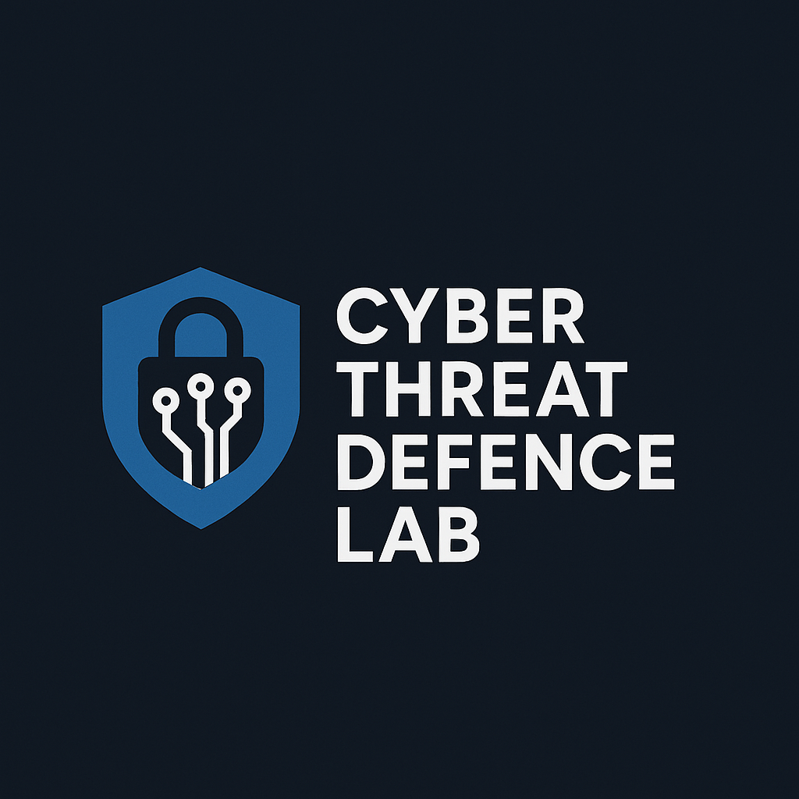

# [Computer Science](https://en.wikipedia.org/wiki/Computer_science)

🎓 [Awesome Automata Theory](https://github.com/cybersecurity-dev/awesome-automata-theory)

🎓 [Awesome Compiler Principles Techniques Tools](https://github.com/cybersecurity-dev/awesome-compiler-principles-techniques-tools)

🎓 [Awesome Computer Organization and Architecture](https://github.com/cybersecurity-dev/awesome-computer-organization-and-architecture)

🎓 [Awesome Programming Language Design](https://github.com/cybersecurity-dev/awesome-programming-language-design)

---

## Algorithms

🎓 [Algorithms in Assembly](https://github.com/cybersecurity-dev/algorithms-in-assembly)

🎓 [Algorithms in C](https://github.com/cybersecurity-dev/algorithms-in-c)

🎓 [Algorithms in C++](https://github.com/cybersecurity-dev/algorithms-in-cpp)

🎓 [Algorithms in F#](https://github.com/cybersecurity-dev/algorithms-in-fsharp)

---

## Data Structures 

🎓 [Data Structures in C](https://github.com/cybersecurity-dev/data-structures-in-c)

🎓 [Data Structures in C++](https://github.com/cybersecurity-dev/data-structures-in-cpp)

🎓 [Data Structures in F#](https://github.com/cybersecurity-dev/data-structures-in-fsharp)

---
---
---
