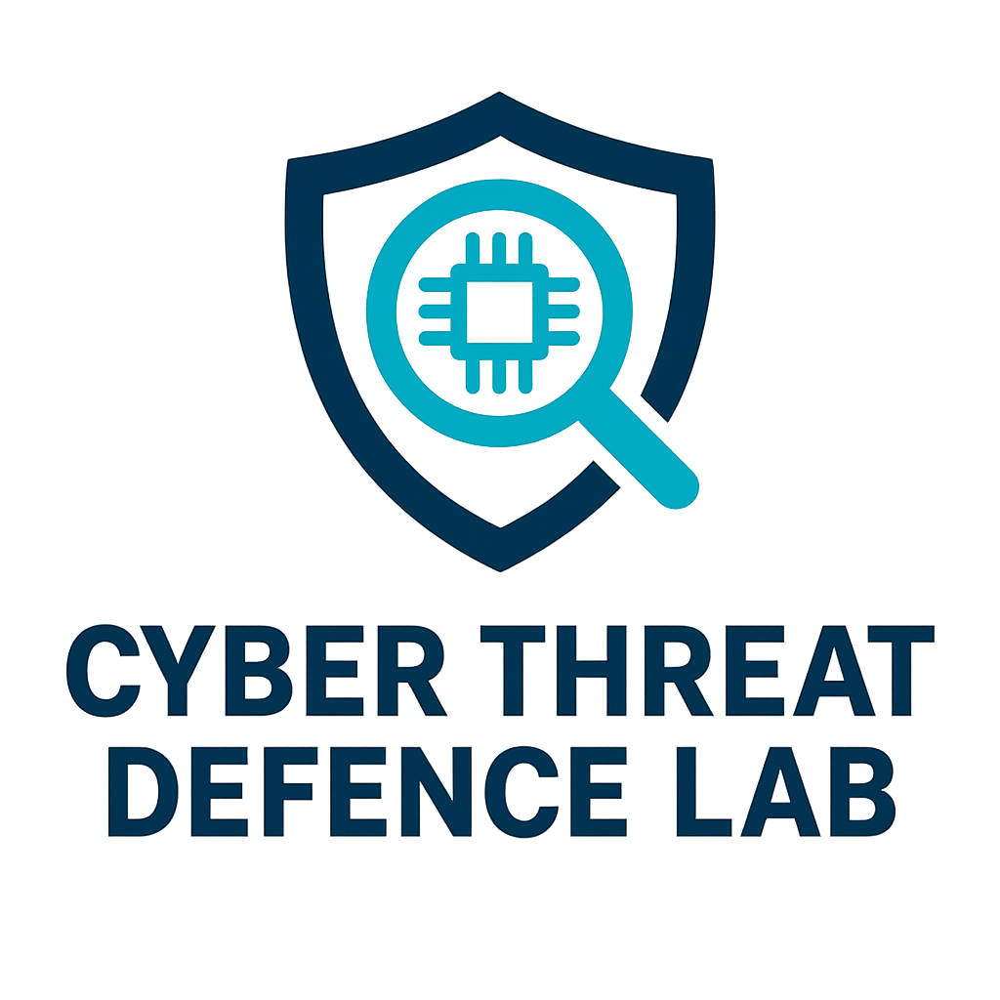

# My [Development](https://en.wikipedia.org/wiki/Software_development) [Toolkits](https://en.wikipedia.org/wiki/Software_development_process)

## [Scripting Language](https://en.wikipedia.org/wiki/Scripting_language) [Toolkit](https://en.wikipedia.org/wiki/Toolchain)
* [Bash Toolkit](https://github.com/cybersecurity-dev/Bash-Toolkit)
* [PowerShell Toolkit](https://github.com/cybersecurity-dev/PowerShell-Toolkit)

---

## [OS](https://en.wikipedia.org/wiki/Operating_system) [Toolkit](https://en.wikipedia.org/wiki/Toolchain)
* [FreeBSD Toolkit](https://github.com/cybersecurity-dev/FreeBSD-Toolkit)

---

## [Programming Language](https://en.wikipedia.org/wiki/Programming_language) [Toolkit](https://en.wikipedia.org/wiki/Toolchain)
* [Assembly Development Toolkit](https://github.com/cybersecurity-dev/Assembly-Toolkit)
* [C Development Toolkit](https://github.com/cybersecurity-dev/C-Toolkit)
* [C++ Development Toolkit](https://github.com/cybersecurity-dev/Cpp-Toolkit)
* [C# Development Toolkit](https://github.com/cybersecurity-dev/csharp-toolkit)
* [F# Development Toolkit](https://github.com/cybersecurity-dev/fsharp-toolkit)
* [Go Development Toolkit](https://github.com/cybersecurity-dev/golang-toolkit)
* [Python Development Toolkit](https://github.com/cybersecurity-dev/Python-Toolkit)
* [Rust Development Toolkit](https://github.com/cybersecurity-dev/Rust-Toolkit)

---

## [PaaS](https://en.wikipedia.org/wiki/Platform_as_a_service) [Toolkit](https://en.wikipedia.org/wiki/Toolchain)
* [Docker Toolkit](https://github.com/cybersecurity-dev/Docker-Toolkit)

---

## [Database](https://en.wikipedia.org/wiki/Database) [Toolkit](https://en.wikipedia.org/wiki/Toolchain)

---
