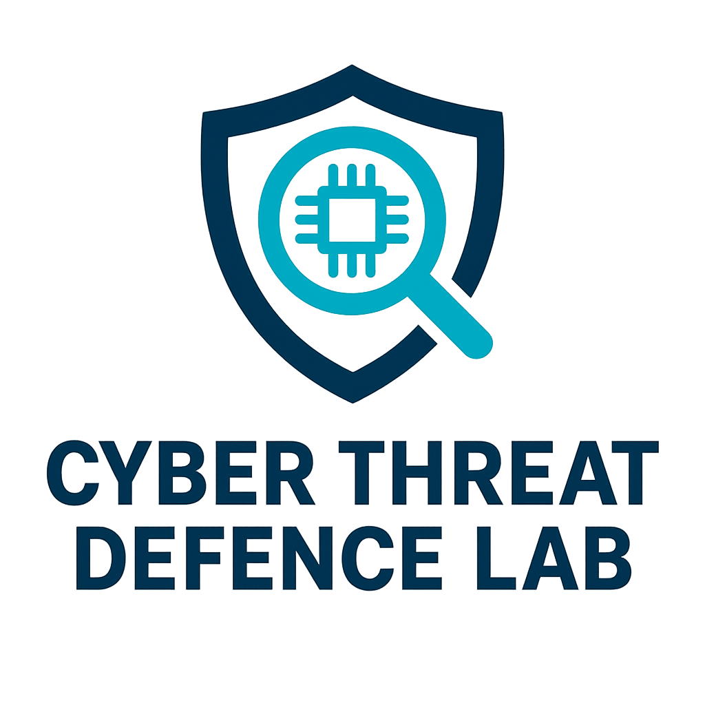

<h1 align="center">My
  <a href="https://wikipedia.org/wiki/Software_development" target="_blank">Development</a>
  <a href="https://github.com/cybersecurity-dev?tab=repositories&q=development-toolkit&type=public&language=&sort=name" target="_blank"><em><strong><code>Toolkits</code></strong></em></a>
</h1>

## [AI](https://wikipedia.org/wiki/Artificial_intelligence) [Toolkit](https://en.wikipedia.org/wiki/Toolchain)
* [Data mining Toolkit](https://github.com/cybersecurity-dev/Data-mining-Toolkit)

---

## [Scripting Language](https://wikipedia.org/wiki/Scripting_language) Toolkit
* [Bash Toolkit](https://github.com/cybersecurity-dev/Bash-Toolkit)
* [PowerShell Toolkit](https://github.com/cybersecurity-dev/PowerShell-Toolkit)

---

## [OS](https://wikipedia.org/wiki/Operating_system) Toolkit
* [APK Static Toolkit](https://github.com/cybersecurity-dev/APK-Static-Toolkit)
* [ELF Static Toolkit](https://github.com/cybersecurity-dev/ELF-Static-Toolkit)
* [FreeBSD Toolkit](https://github.com/cybersecurity-dev/FreeBSD-Toolkit)
* [PE Static Toolkit](https://github.com/cybersecurity-dev/PE-Static-Toolkit)

---

## Low-level [Programming](https://wikipedia.org/wiki/Low-level_programming_language) Toolkit
* [Linux Driver Development Toolkit](https://github.com/cybersecurity-dev/linux-driver-development-toolkit)
* [Linux System Programming Toolkit](https://github.com/cybersecurity-dev/linux-system-programming-toolkit)

---

## [Programming Language](https://wikipedia.org/wiki/Programming_language) Toolkit
* [Assembly Development Toolkit](https://github.com/cybersecurity-dev/Assembly-Toolkit)
* [C Development Toolkit](https://github.com/cybersecurity-dev/C-Toolkit)
* [C++ Development Toolkit](https://github.com/cybersecurity-dev/Cpp-Toolkit)
* [C# Development Toolkit](https://github.com/cybersecurity-dev/csharp-toolkit)
* [F# Development Toolkit](https://github.com/cybersecurity-dev/fsharp-toolkit)
* [Go Development Toolkit](https://github.com/cybersecurity-dev/golang-toolkit)
* [Python Development Toolkit](https://github.com/cybersecurity-dev/Python-Toolkit)
* [Rust Development Toolkit](https://github.com/cybersecurity-dev/Rust-Toolkit)

---

## [PaaS](https://wikipedia.org/wiki/Platform_as_a_service) Toolkit
* [Docker Toolkit](https://github.com/cybersecurity-dev/Docker-Toolkit)

---

## [Database](https://wikipedia.org/wiki/Database) Toolkit
* [RDBMS Toolkit](https://github.com/cybersecurity-dev/RDBMS-Toolkit)

---

## Software [Version Control](https://wikipedia.org/wiki/Version_control) System
* [Git Toolkit](https://github.com/cybersecurity-dev/Git-Toolkit)

---
---
---

