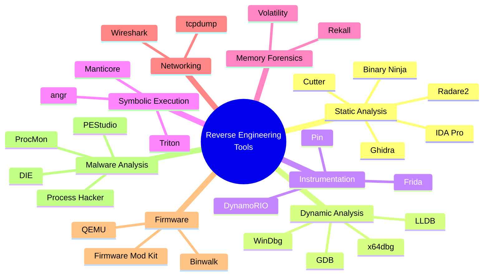

<h1 align="center"><em><strong><code>Reverse Engineering</code></strong></em> Tools</h1>

## Encoding / Decoding

### [CyberChef](https://gchq.github.io/CyberChef/)
*

## x86/x64 Assembler 

## Disassemblier

## Debugging Tools

### [GDB](https://www.sourceware.org/gdb/)
*

### [WinDbg](https://learn.microsoft.com/windows-hardware/drivers/debuggercmds/windbg-overview)
*

## Decompilers 

### [IDA Pro](https://hex-rays.com/ida-pro)
*

### [Ghidra](https://github.com/NationalSecurityAgency/ghidra)
*

### [x64dbg](https://x64dbg.com/)
*

## Memory Forensics

### [VolUtility](https://github.com/kevthehermit/VolUtility)
*

### [Volatility](https://github.com/volatilityfoundation/volatility3)
*

## Miscellaneous

### [Sysinternals](https://learn.microsoft.com/sysinternals/)
*

### [Process Hacker](https://systeminformer.sourceforge.io/) 
*

### [Wireshark](https://www.wireshark.org/)
*

### [CFF Explorer](https://ntcore.com/explorer-suite/)
*

### Binary Internals
- [APK Editor Studio](https://qwertycube.com/apk-editor-studio/) - Free APK editor for PC and Mac.
- [PeStudio](https://www.winitor.com/) - PeStudio is a analysis tool for PE.

