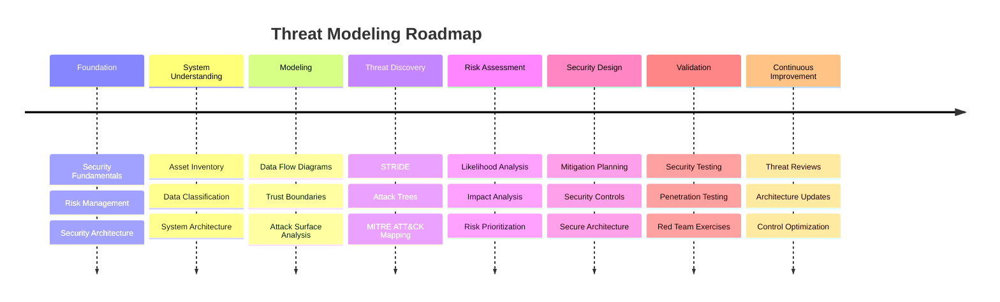

<h1 align="center"><em><strong><code>Threat</code></strong></em> Modeling</h1>

- [Microsoft Threat Modeling](https://www.microsoft.com/securityengineering/sdl/threatmodeling)
- [OWASP Threat Modeling](https://owasp.org/www-community/Threat_Modeling)

## Threat Modeling Tools
- [Microsoft Threat Modeling Tool](https://learn.microsoft.com/azure/security/develop/threat-modeling-tool) - The Threat Modeling Tool is a core element of the Microsoft Security Development Lifecycle ([SDL](https://www.microsoft.com/securityengineering/sdl)). It allows software architects to identify and mitigate potential security issues early, when they are relatively easy and cost-effective to resolve. As a result, it greatly reduces the total cost of development.
- [Threat Dragon](https://owasp.org/www-project-threat-dragon/) - OWASP Threat Dragon is a modeling tool used to create threat model diagrams as part of a secure development lifecycle. Threat Dragon follows the values and principles of the [threat modeling manifesto](https://www.threatmodelingmanifesto.org/).

## Tools
- [PyTM](https://github.com/OWASP/pytm) - A Pythonic framework for threat modeling.
