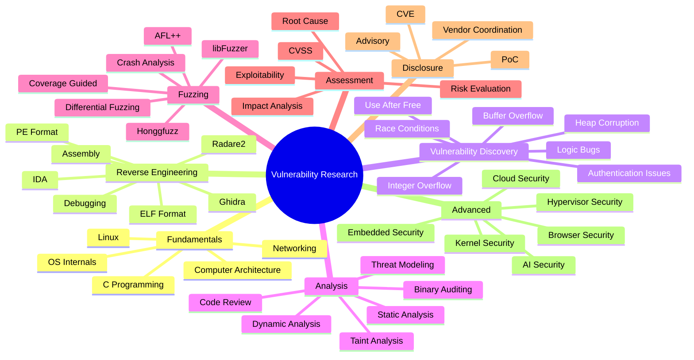

<h1 align="center"><em><strong><code>Vulnerability</code></strong></em> Research</h1>

## Online Vulnerability Tracking Tools 
- [VulDB](https://github.com/vuldb) - Vulnerability management and threat intelligence [platform](https://vuldb.com/) documenting and explaining vulnerabilities since 1970.
- [Vulnerability-Lookup](https://www.vulnerability-lookup.org/) - **Vulnerability-Lookup** facilitates quick correlation of vulnerabilities from various sources, independent of vulnerability IDs, and streamlines the management of Coordinated Vulnerability Disclosure (CVD).
- [Open Source Vulnerability](https://osv.dev/) - A distributed vulnerability database for Open Source

## Vulnerability-Oriented Standards

### Identification and Enumeration Standards
  - [CVE](https://www.cve.org/) - Common Vulnerabilities and Exposures (_**CVE**™_) Program is to identify, define, and catalog publicly disclosed cybersecurity vulnerabilities. There is one CVE Record for each vulnerability in the catalog. The vulnerabilities are discovered then assigned and published by organizations from around the world that have partnered with the CVE Program.
  - [CWE](https://cwe.mitre.org/) - Common Weakness Enumeration (_**CWE**_) is a list of common software and hardware weakness types. It categorizes the causes of vulnerabilities, helping developers and security professionals understand and prevent them from being introduced in the first place.

### Scoring and Assessment Standards
  - [CVSS](https://www.first.org/cvss) - Common Vulnerability Scoring System (_**CVSS**_) provides a way to capture the principal characteristics of a vulnerability and produce a [numerical score](https://www.first.org/cvss/calculator) reflecting its severity.

### Management and Remediation Standards/Frameworks
  - [ASVS](https://owasp.org/www-project-application-security-verification-standard/) - OWASP Application Security Verification Standard (_**ASVS**_) provides a basis for testing web application technical security controls and offers developers a list of requirements for secure development. It's often used to establish a level of confidence in the security of web applications.
  - [NIST CSF](https://www.nist.gov/cyberframework) - National Institute of Standards and Technology (_**NIST**_) Cybersecurity Framework's (_**CSF**_) "Identify" and "Protect" functions emphasize understanding and mitigating vulnerabilities.

## Vulnerability Scanner
- [OSV-Scanner](https://google.github.io/osv-scanner/) - Vulnerability scanner written in Go which uses the data provided by [osv.dev](https://osv.dev)
